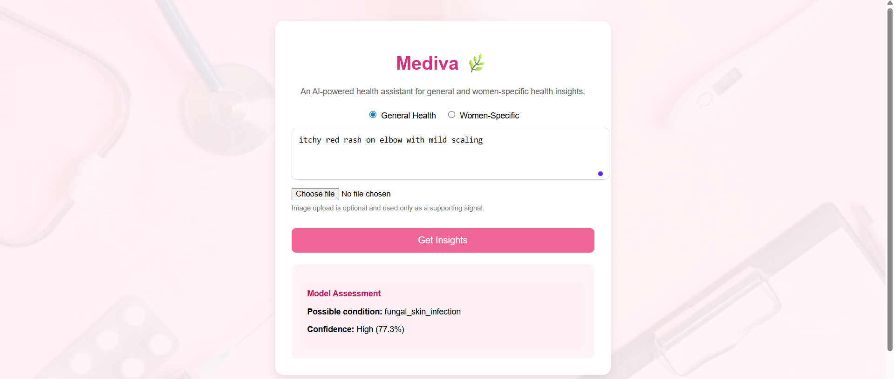
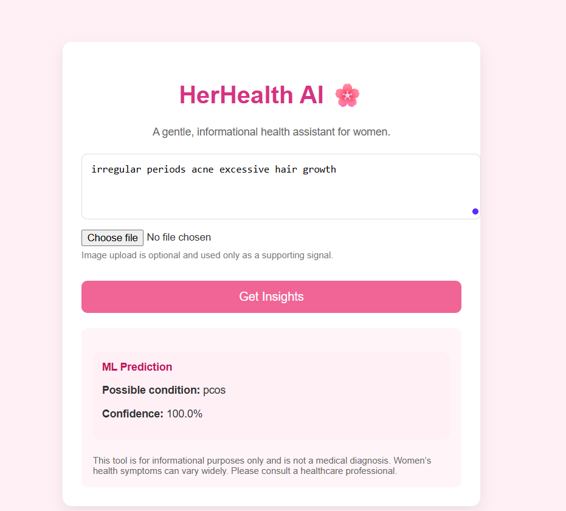
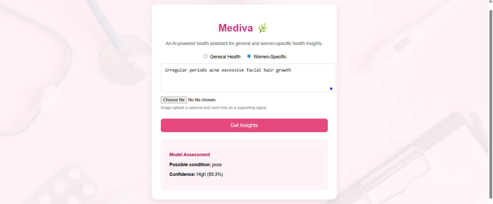

# 🌿 Mediva — AI-Powered Health Insight System

Mediva is an AI-powered health insight system that provides **general** and **women-specific** health assessments using **machine learning, embeddings, and safety-aware AI design**.

The project focuses on **responsible AI**, avoiding overconfident medical claims while guiding users with meaningful follow-up questions when certainty is low.

---

## ✨ Key Features

- 🧠 **ML-based Symptom Understanding**  
  Uses sentence embeddings and cosine similarity to match user-described symptoms with known medical conditions.

- 🔁 **Dual Health Modes**
  - **General Health Mode**
  - **Women-Specific Health Mode** (e.g., PCOS, anemia, menstrual health)

- 🛡️ **Confidence Gating & Safe Mode**
  - No fake 100% confidence
  - Low-confidence predictions automatically trigger safe-mode responses
  - Encourages clarification instead of risky outputs

- 🤖 **LLM-Assisted Follow-up Questions**
  - When confidence is low, the system generates intelligent follow-up questions
  - Falls back gracefully if the LLM is unavailable

- 🖼️ **Optional Image Upload**
  - Images are treated strictly as **supporting signals**
  - Never used as sole evidence for predictions

---

## 🧪 Example Outputs

### 1️⃣ General Health — High Confidence Prediction
**Input:**  
> *“itchy red rash on elbow with mild scaling”*

**Output:**  
- Predicted condition with **high confidence**
- No unnecessary warnings
- Clean, interpretable response

---

### 2️⃣ Low Confidence → AI Safe Mode
**Input:**  
> *“feeling a bit off lately”*

**Output:**  
- Safe Mode activated
- No condition asserted
- AI-generated follow-up questions shown

---

### 3️⃣ Women-Specific Health Mode
**Input:**  
> *“irregular periods acne excessive facial hair growth”*

**Output:**  
- Women-specific condition detected (e.g., PCOS)
- Appropriate disclaimer included
- Confidence shown transparently

---

## 🧠 How It Works (Technical Overview)

1. **Text Embeddings**  
   Symptoms are converted into vector embeddings using a sentence transformer.

2. **Similarity Matching**  
   Cosine similarity is computed against a curated dataset of symptom variations.

3. **Confidence Estimation**  
   Confidence is calculated using similarity margins instead of raw probabilities.

4. **Safety Layer**  
   - Low confidence → Safe Mode  
   - High-risk ambiguity → No definitive prediction

5. **LLM Integration**  
   Used only for **follow-up questions**, not diagnosis.

---

## 🛠️ Tech Stack

- **Backend:** Python, Flask  
- **ML:** Sentence Transformers, scikit-learn, NumPy  
- **LLM:** OpenAI (with fallback mode)  
- **Frontend:** HTML, CSS, Vanilla JavaScript  
- **Data:** AI-generated + curated symptom datasets

---

## ⚠️ Disclaimer

Mediva is **not a medical diagnostic tool**.  
It is designed for **educational and exploratory purposes only**.  
Users are encouraged to consult qualified healthcare professionals for medical advice.
